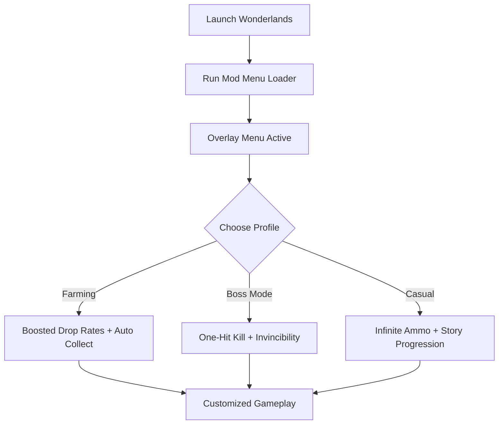

# Tiny Tina’s Wonderlands Mod Menu 🧩

**Tiny Tina’s Wonderlands** delivers chaotic fantasy looter-shooter fun, filled with magic, dungeons, and endless loot drops. The **Tiny Tina’s Wonderlands Mod Menu** takes it further by letting you **customize gameplay with real-time overlays**, turning farming grinds into fast progress and giving you creative control over spells, loot, and visuals.

---

## 🌐 Overview

The Mod Menu acts as an **in-game customization hub**. With a single hotkey, you can open the overlay and toggle cheats, adjust loot rarity, or unlock all weapons instantly. Profiles make it easy to switch between farming setups, boss builds, and casual play, all without editing config files.

---

## 🔑 Features

* 🖥 **Overlay Interface** – Toggle mods instantly during gameplay.
* 🔫 **Combat Tweaks** – Infinite ammo, no reload, and damage multipliers.
* 💰 **Resource Control** – Unlimited gold, crystals, and moon orbs.
* 🎲 **Loot Mods** – Boost drop rates, auto-collect legendaries, or unlock all gear.
* 🧙 **Spell Enhancements** – Zero cooldowns, infinite charges, and elemental swaps.
* 🛡 **Survivability** – Invincibility, shield boosts, and regen mods.
* 🎨 **Visual Customization** – HUD themes, dungeon lighting, and particle tweaks.
* 🗂 **Profile Loader** – Save configs for farming, bosses, or story mode.
* ⌨️ **Hotkey Switching** – Apply changes instantly with function keys.

---

[](#)
[](#)
[](#)
[](#)

---

## 🖥 Compatibility

| Platform       | Status        | Notes                       |
| -------------- | ------------- | --------------------------- |
| Windows 10     | ✅ Supported   | Stable builds               |
| Windows 11     | ✅ Optimized   | Smoothest overlay rendering |
| Linux (Proton) | ⚠️ Partial    | Loot mods may desync        |
| macOS          | ❌ Unsupported | VM workaround required      |

[!NOTE]
The Mod Menu is optimized for **Windows PC builds of Tiny Tina’s Wonderlands**.

---

## ⚙️ Setup Guide

1. Download the **Tiny Tina’s Wonderlands Mod Menu**.

2. Extract into the game’s installation folder.

3. Launch Wonderlands.

4. Run the mod loader with administrator rights:

   ```bash
   wonderlands_modmenu.exe -game wonderlands.exe -overlay on
   ```

5. Open the menu in-game with `F4`.

6. Configure via overlay or `modmenu.ini`:

   ```ini
   [Combat]
   InfiniteAmmo=True
   DamageMultiplier=3
   NoReload=True

   [Resources]
   Gold=Unlimited
   Crystals=5000
   MoonOrbs=9999

   [Loot]
   DropRate=LegendaryBoost
   AutoCollect=True
   UnlockAll=True

   [Spells]
   Cooldown=0
   InfiniteCharges=True

   [Visuals]
   HUDTheme=DarkMode
   Lighting=Enhanced
   ```

[!IMPORTANT]
Always back up your saves before enabling experimental mods.

---

## 📊 Menu Workflow



---

## 🎚 Example Configurations

**Farming Profile:**

```ini
Gold=Unlimited
DropRate=LegendaryBoost
AutoCollect=True
```

**Boss Fight Profile:**

```ini
DamageMultiplier=5
Invincible=True
InfiniteAmmo=True
```

**Casual Profile:**

```ini
Gold=Multiplier:2
InfiniteAmmo=True
HUDTheme=DarkMode
```

[!WARNING]
High loot multipliers can overwhelm inventory—adjust for balanced farming.

---

## ❓ FAQ

**Q: Does the mod menu work in co-op?**
A: No, it’s single-player only.

**Q: Can I unlock everything instantly?**
A: Yes, set `UnlockAll=True` in the Loot section.

**Q: Does it affect FPS?**
A: No, the overlay is lightweight (<3% usage).

**Q: Will updates follow game patches?**
A: Yes, menu builds track Wonderlands patch cycles.

**Q: Can I save multiple builds?**
A: Yes, profiles allow instant hot-swapping.

---

## 🚀 Final Thoughts

The **Tiny Tina’s Wonderlands Mod Menu** gives you **control over loot farming, combat, and visual tweaks** in a clean overlay. Whether you’re chasing legendary gear, breezing through the story, or experimenting with spell builds, this menu lets you shape the game to your liking.

[](#)
[](#)
[](#)

---
